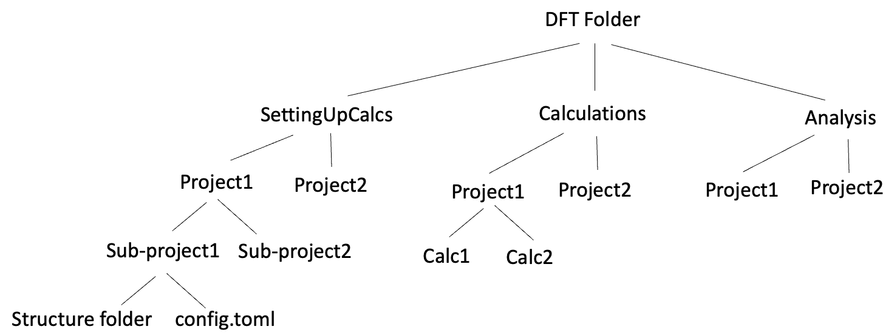

# README #

### What is this repository for? ###

* A script responsible for the creation of vasp jobs, and the uploading and downloading of jobs to and from a remote server (e.g. Tulane's Cypress)

### How do I get set up? ###

* Clone repository:
    `git clone https://Silicon_Scientist@bitbucket.org/silicon_scientist/dft_submission.git`
* Install dependencies on your computer:
    `pip install -r requirements.txt`
* Configure "dft" alias in your .zshrc file:
    `alias dft='python /Users/averyhill/Documents/Bitbucket/dft_submission/__main__.py'`

* Create a DFT folder setup according to our group's project scheme:
    
* Fill your sub-project's structure folder with structures (format="vasp")
* Create a config.toml file based on this repository's example_config.toml file.
* Upload your jobs to a remote server via the command:
    `dft push config.toml`
* Go onto the remote server and submit your jobs
* Download completed jobs via the command:
    `dft pull config.toml`
* Job well done! Now go analyze your jobs' output in your analysis folder!

### Areas where we could improve this script:
* This script has only been tested on Mac. Work with other students who use Windows to troubleshoot issues.
* This script currently relies on a directory of structures as input, but what if we only need one structure, but multiple parameter sets (i.e. a bunch of config.toml files). One idea is to have a "configurations" folder in the sub-project directory.
* Package this repository: https://packaging.python.org/en/latest/tutorials/packaging-projects/
* This script only take structures with format="vasp", but we could make a variable in the configuration files called "structure_format" that could include other formats ("xyz", "cif, "gro", etc.).
* Redundant use of the "system_name" variable in the configuration files.

### Who do I talk to? ###

* If you have issues or questions about the submission script, reach out to Avery Hill (ahill15@tulane.edu)
* PI: Dr. Matthew Montemore (mmontemore@tulane.edu)
